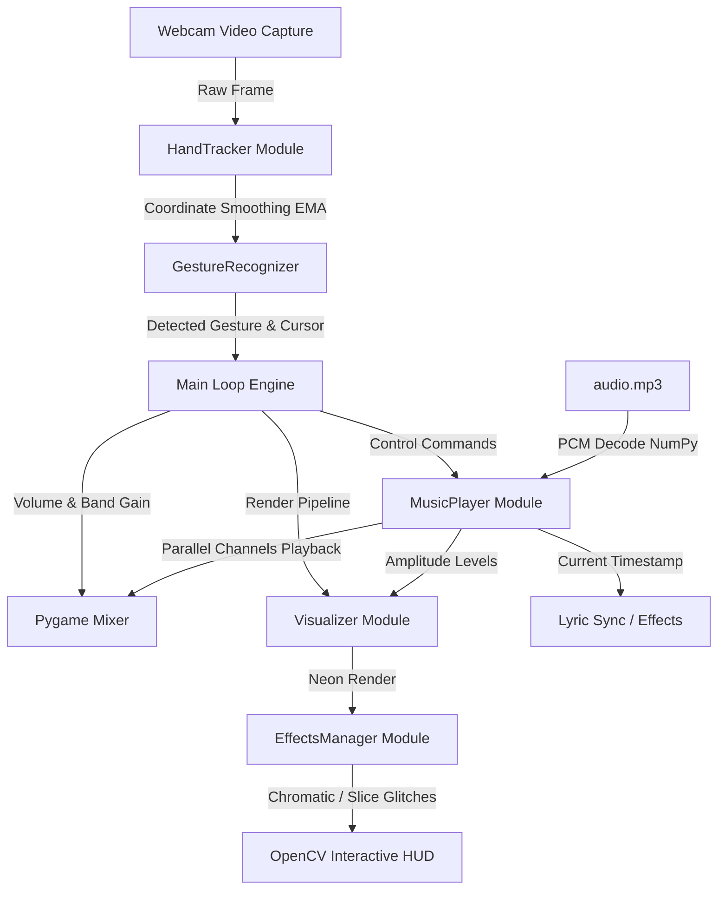

# Gesture Glitch & Concert Audio Visualizer v3.0 🎵✋⚡

Aplikasi interaktif berbasis Python yang menggabungkan *real-time hand tracking*, pemrosesan sinyal digital (*audio DSP*), dan efek gangguan visual (*cinematic screen glitches*). Sistem mendeteksi koordinat tangan melalui webcam untuk mengendalikan musik, memicu filter audio, memanipulasi *equalizer*, dan memproyeksikan visualisasi neon dinamis yang tersinkronisasi dengan lirik lagu.

---

## 🚀 Fitur Utama

### 1. Real-Time Audio DSP & Crossfader
Sistem melakukan dekomposisi data PCM audio secara *real-time* untuk menghasilkan beberapa efek suara yang dikendalikan oleh tangan:
*   **Volume Slider (Pinch):** Mengatur tingkat kenyaringan suara (gain) secara kontinu berdasarkan posisi vertikal tangan.
*   **Muffled / Low-Pass Filter (Fist):** Menyaring frekuensi tinggi, menciptakan efek suara teredam di bawah air menggunakan *moving average filter*.
*   **Lo-Fi / Bitcrusher (Victory):** Melakukan *downsampling* sinyal audio secara destruktif untuk menghasilkan karakter suara retro 8-bit.
*   **Normal / Equalizer Crossover:** Mengarahkan kembali aliran audio ke kanal normal dengan opsi manipulasi gain frekuensi secara terpisah.

### 2. Efek Screen Glitch Sinematik
Kombinasi efek visual pasca-pemrosesan (*post-processing*) OpenCV yang intensitasnya terikat langsung pada amplitudo audio (volume rata-rata):
*   **Chromatic Aberration:** Menggeser *channel* warna merah (R) dan biru (B) secara horizontal untuk menciptakan efek bias lensa optik.
*   **Slice Displacement:** Mengacak koordinat horizontal baris-baris piksel secara acak pada area layar tertentu.
*   **VHS Digital Noise:** Garis-garis statis horisontal dan distorsi piksel yang muncul secara intens saat melakukan gesture mengepal tangan.
*   **Screen Shake:** Mengguncang koordinat kamera OpenCV secara acak seiring dengan kekuatan frekuensi bass.

### 3. Neon Audio Visualizer (4 Mode)
*   **Circle Wave:** Lingkaran konsentris neon yang memancar dari koordinat telapak tangan, merespons spektrum bass, mid, dan treble secara radial.
*   **Oscilloscope Wave:** Representasi gelombang osiloskop multi-lapisan di bagian bawah layar.
*   **Spectrum Bars:** Balok spektrum frekuensi vertikal klasik dengan efek *mirroring* reflektif.
*   **Concert Visualizer:** Mode hibrida premium yang menggabungkan cincin frekuensi radial, balok reflektif penuh, dan pancaran sinar (*radiating rays*).

### 4. Concert Mode & Love Mode
*   **Concert Mode (Dual Open Palm):** Mengaktifkan modul simulasi panggung konser: lampu sorot berputar (*spotlights*), pancaran garis laser koordinat, hujan konfeti fisik, serta efek strobe flash.
*   **Love Mode (Heart Gesture):** Mengubah tema HUD menjadi gelap-pink romantis, mengaktifkan pemancar partikel berbentuk hati (*heart particles*), dan menampilkan lirik lagu 《代替我》 (*JUSF周存*) secara tersinkronisasi dengan efek *glowing text*.

---

## 📐 Arsitektur Sistem & Alur Data

Sistem berjalan pada satu *looping thread* utama yang mengoordinasikan input video, pelacakan sendi tangan, pemrosesan audio, dan perenderan grafis:



---

## 🛠️ Detail Teknis

### 1. Pemrosesan Sinyal Digital (Audio DSP) dengan NumPy
Untuk menghindari ketergantungan pada *binary external* seperti `ffmpeg`, pengodean dan manipulasi audio dilakukan langsung pada memori menggunakan NumPy terhadap representasi byte PCM mentah (*raw PCM bytes*) yang dimuat via `pygame.mixer.Sound`:

*   **Penyaringan Low-Pass (Muffled):**
    Menggunakan algoritma *Cumulative Sum* (Cumulative Moving Average) dengan ukuran *windowing* sebesar 24 sampel untuk memotong frekuensi tinggi:
    $$y[n] = \frac{1}{W} \sum_{i=0}^{W-1} x[n-i]$$
*   **Bitcrush / Downsampling (Lo-Fi):**
    Mengurangi frekuensi *sampling* sinyal dengan mengambil sampel setiap $N$ indeks (`samples[::factor, :]`) dan menduplikasikannya kembali menggunakan `np.repeat` untuk menjaga dimensi array serta durasi audio tetap konsisten.
*   **Crossover 3-Band Equalizer:**
    Membagi spektrum audio menjadi 3 jalur frekuensi terpisah secara *software-defined*:
    1.  *Bass Band:* Diperoleh melalui *Low-Pass Filter* (LPF) dengan ukuran jendela besar ($W = 80$).
    2.  *Treble Band:* Diperoleh dari selisih sinyal asli dengan *Low-Pass Filter* jendela kecil ($W = 8$).
    3.  *Mid Band:* Sisa spektrum di antara Bass dan Treble (LPF jendela kecil dikurangi LPF jendela besar).
    Masing-masing kanal dimainkan secara paralel pada kanal Pygame terpisah dan volumenya dimodulasi dinamis oleh gesture tangan.

### 2. Pipeline Efek Grafis OpenCV
*   **Chromatic Aberration:**
    Pemisahan kanal BGR menggunakan `cv2.split()`. Kanal merah digeser ke arah kiri sebesar $d$ piksel, sedangkan kanal biru digeser ke kanan sebesar $d$ piksel menggunakan translasi matriks affine `cv2.warpAffine()`. Ketiga kanal kemudian digabungkan kembali dengan `cv2.merge()`.
*   **Slice Displacement:**
    Memotong potongan baris horizontal secara acak dengan rentang indeks tinggi `y` ke `y+h`, menggesernya secara horizontal dengan operasi *roll* NumPy (`np.roll`), lalu memasukkannya kembali ke frame utama.
*   **Sistem Partikel Fisika Semu:**
    Partikel (bentuk lingkaran, bintang, hati, dan konfeti) dihitung secara individual menggunakan objek kelas `Particle`. Setiap partikel diperbarui dengan vektor kecepatan ($v_x, v_y$), gaya gravitasi buatan ($g_y$), rotasi angular, dan waktu hidup (*lifetime decay*).

---

## 📁 Struktur Proyek

```
handtracking/
├── main.py                   # Loop utama, inisialisasi OpenCV, HUD telemetry, boot sequence
├── hand_tracker.py           # Pelacak tangan MediaPipe, penanganan VideoMode, peredam jitter EMA
├── hand_landmarker.task      # Model jaringan saraf tiruan pelacakan tangan MediaPipe
├── gestures.py               # Algoritma klasifikasi gesture berbasis jarak sendi dan sudut
├── visualizer.py             # Generator rendering visualizer audio neon (Circle, Wave, Bar, Concert)
├── music.py                  # Pemutar audio paralel & DSP engine (LPF, Bitcrush, 3-Band Equalizer)
├── effects.py                # Efek glitch pasca-proses, sistem partikel, trail, dan sinkronisasi lirik
├── requirements.txt          # Daftar dependensi modul Python
├── README.md                 # Dokumentasi utama proyek
├── GESTURE_GUIDE.md          # Panduan interaktif visualisasi pola tangan
└── assets/
    ├── audio.mp3             # File lagu default
    ├── 代替我-JUSF周存.lrc    # Lirik tersinkronisasi (Terjemahan Bahasa Indonesia)
    └── 代替我-JUSF周存chin.lrc # Lirik tersinkronisasi (Bahasa Mandarin asli)
```

---

## ⚙️ Instalasi & Persiapan

### Prasyarat Sistem
*   Python **3.10** atau lebih baru.
*   Webcam internal atau eksternal yang terhubung dan terdeteksi oleh sistem.

### Langkah Instalasi

1.  Clone atau salin repositori ini ke komputer Anda.
2.  Instal seluruh pustaka dependensi yang dibutuhkan:
    ```bash
    pip install -r requirements.txt
    ```
3.  Unduh file model detektor tangan MediaPipe jika belum tersedia secara otomatis:
    [Download hand_landmarker.task](https://storage.googleapis.com/mediapipe-models/hand_landmarker/hand_landmarker/float16/latest/hand_landmarker.task)  
    Tempatkan file `hand_landmarker.task` tersebut langsung di direktori akar proyek.
4.  Pastikan terdapat file audio berformat `.mp3` di dalam direktori `assets/`. Secara default sistem akan mendeteksi `assets/audio.mp3`.

---

## 🎮 Cara Menjalankan & Kontrol

Jalankan skrip utama menggunakan interpreter Python:
```bash
python main.py
```

Jika kamera default Anda tidak terbuka atau terjadi error pencarian webcam, Anda dapat membuka file [main.py](file:///d:/handtracking/main.py) dan menyesuaikan variabel konfigurasi berikut:
*   `CAMERA_INDEX = 0` (ubah ke 1 atau 2 untuk webcam eksternal).
*   `FRAME_WIDTH` dan `FRAME_HEIGHT` untuk menyesuaikan resolusi tangkapan kamera.

### Pintasan Keyboard (Fallback & Debug)
| Tombol | Deskripsi Fungsi |
| :---: | --- |
| **`M`** | Memutar (*Play*) atau Menjeda (*Pause*) trek musik utama. |
| **`T`** | Berpindah tipe visualizer (*Circle* ➔ *Wave* ➔ *Bar* ➔ *Concert*). |
| **`C`** | Mengaktifkan/menonaktifkan *Concert Mode* secara instan. |
| **`SPACE`** | Melewati animasi urutan boot awal (*Skip Boot Sequence*). |
| **`Q` / `ESC`** | Menutup aplikasi dan melepaskan seluruh sumber daya kamera/audio secara aman. |

---

## 📋 Ringkasan Kontrol Gesture

Detail lengkap mengenai jarak antar-sendi dan cara kerja interaksi gesture dapat dibaca pada [PANDUAN GESTURE](file:///d:/handtracking/GESTURE_GUIDE.md).

| Gesture | Bentuk Tangan | Tindakan Audio | Efek Visual |
| :--- | :--- | :--- | :--- |
| **`PINCH`** | Jempol bertemu telunjuk | Atur volume naik/turun (vertikal) | Semburan partikel listrik neon |
| **`FIST`** | Seluruh jari mengepal | Aktifkan filter *Muffled* (Low-Pass) | Guncangan layar + VHS horizontal noise |
| **`VICTORY`** | Jari telunjuk dan tengah terbuka | Aktifkan filter *Lo-Fi* (Bitcrush) | Glitch visual ringan |
| **`POINT_UP`** | Hanya jari telunjuk menghadap ke atas | - | Berpindah tipe visualizer neon |
| **`OPEN_PALM`** | Seluruh telapak tangan terbuka | Reset audio ke normal & volume 100% | Menstabilkan efek guncangan layar |
| **`HEART`** | Jempol & telunjuk kedua tangan membentuk hati | - | Mengaktifkan *Love Mode* + Lirik lagu |
| **`THREE_THREE`**| 3 jari tengah terbuka pada kedua tangan | Aktifkan/nonaktifkan menu Equalizer | Membuka *Virtual Equalizer Overlay* |
| **`ALL_OPEN`** | 10 jari terbuka lebar pada kedua tangan | - | Mengaktifkan *Concert Mode* penuh |

---

## 🎛️ HUD Telemetry
Tampilan antarmuka (HUD) menampilkan status telemetri secara *real-time* untuk memudahkan pemantauan kinerja aplikasi:

```
[ TELEMETRY STATUS ]         [ AUDIO SOURCE ]
FPS: 60                      STATUS: PLAYING
HANDS: 1                     TIME: 01:45
GESTURE: PINCH               ▓▓▓▓▓▓▓░░░ (Volume level)
MODE: BUILD
VISUALIZER: CIRCLE
DSP FILTER: NORMAL
MASTER VOL: 70%
GLITCH RATE: 12%
CONCERT: OFF
```

---

## 🛠️ Pemecahan Masalah (Troubleshooting)

*   **Error: `hand_landmarker.task tidak ditemukan!`**
    Pastikan file model saraf MediaPipe telah diunduh dengan benar dan diletakkan pada folder yang sama dengan file `main.py` atau di dalam folder `assets/`.
*   **Kamera Terlihat Gelap atau Deteksi Tidak Responsif:**
    Algoritma pengenalan gesture sangat dipengaruhi oleh kualitas citra kamera. Pastikan pencahayaan ruangan Anda cukup merata. Hindari pencahayaan latar (*backlight*) yang terlalu kontras.
*   **Performa Tersendat-sendat (FPS Rendah):**
    MediaPipe Hand Landmarker memakan daya komputasi CPU/GPU yang signifikan. Jika FPS turun di bawah 20, kurangi resolusi tangkapan dengan mengubah `FRAME_WIDTH = 320` dan `FRAME_HEIGHT = 240` pada file `main.py`.
*   **Tidak Ada Suara Lagu:**
    Periksa apakah file `assets/audio.mp3` benar-benar ada dan codec audio sistem operasi Anda mendukung pemutaran MP3 via Pygame. Jika menggunakan audio berformat lain, pastikan namanya disesuaikan atau ganti ekstensinya.
